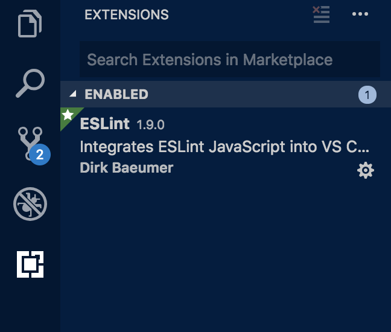
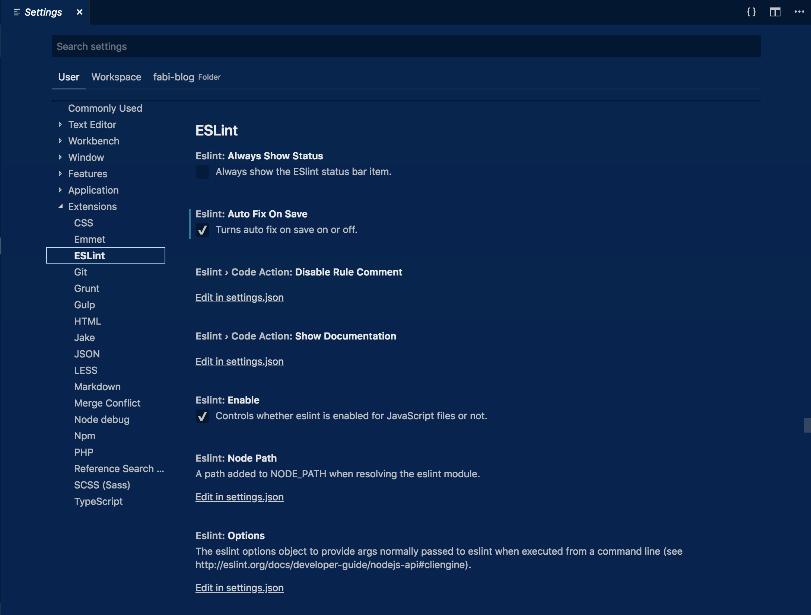

###Hey guys!###

Let me start this one of with a few common things you could have heard already saying yourself or you heard saying your developer peers:
> I just cannot get myself to remember all the rules to formatting all of my code the same way

> I could have avoided that error if I would have noticed the wrong syntax

> Why are you putting all those brackets into a new line?

I have heard a mixture of those more or less multiple times throughout my last two years working in an e-commerce business. But fear not, there actually is an easy way to solve all of those issues and make that part of software development a breeze. Therefore I want to show you in this one how you can introduce a linting process in your projects that prevents those statements from the very beginning.


###What do actually you mean by "linting"?###

Linting is the process of checking your code before you even compile or run it. A linter is therefore a program that supports linting your code (no way Sherlock). In our case we need to lint Javascript code. There are multiple linters available for that, namely JSLint, JSHint, JSCS and ESLint whereas ESLint is the latest one. As of the time of wrinting ESLint has multiple advantages over the others:
- It can be vastly configured and even allows tweaking for specific rules
- It is very extensible and has a plethora of plugins available
- It has the best ES6 support of all the linters (including JSX)

But there is also a negative aspect to its configurable and extensible nature in that it actually needs to be configured; and adjusting it to your liking actually takes a ton of time because of the many rules and options it provides.


###But I do not want to configure all those rules ...###

Of course you can use the setup of ESLint itself to create the rules for you. But this still takes a lot of time to understand the rules, answer some questions and set it up at all. And this is when we can use an already existing set of rules in order to lint our project. Like you many businesses that write Javascript code already had the exact same problems and therefore introdcued linting in their projects. There are two famous rule sets as of right now to use: Google and Airbnb. We will use Airbnb which is the prefered version over Google and provides a really good foundation for every kind of Javascript project.

<a href="https://eslint.org/docs/rules/" target="_blank">Here is the list with all the available rules, feel free to configure your own!</a>

###Oke, you got me! Show me how to set it up in Visual Studio Code!###

1. Install the ESLint plugin in your Visual Studio Code (you will find it probably by just searching for ESLint)
    
1. Also we need to enable ESLint in Visual Studio Code and enable it to fix our files automatically on saving! (Could it get any better?)
    
1. Next we need to install all required dependencies as dev-dependencies in our project
    - When you are running an npm version 5+ you can use this command:
    ```bash
    npx install-peerdeps --dev eslint-config-airbnb
    ```
    - Otherwise you need to check for all required dependencies yourself and install them separatly:
    ```bash
    npm info "eslint-config-airbnb@latest" peerDependencies
    npm install --dev ...
    ```
    - You can check your package.json after, you should have packages similiar to this:
    ```json
        "devDependencies": {
            "eslint": "^5.3.0",
            "eslint-config-airbnb": "^17.1.0",
            "eslint-plugin-import": "^2.17.3",
            "eslint-plugin-jsx-a11y": "^6.2.1",
            "eslint-plugin-react": "^7.13.0"
        }
    ```
1. Finally we need to set up our configuration file for the project: just create a file called '.eslintrc.json' in the root directory of your project (which is usally the same directory as your package.json file) and enter the following:
    ```json
    {
        "extends": "airbnb"
    }
    ```

Linting is the best thing I have ever done to my projects and you should too.

Have fun and happy linting!